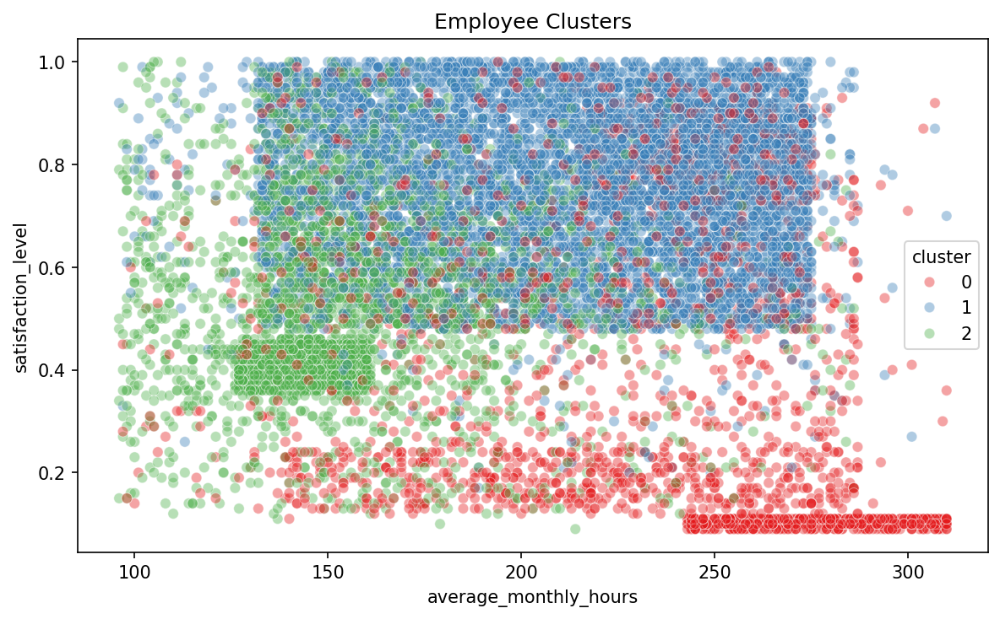
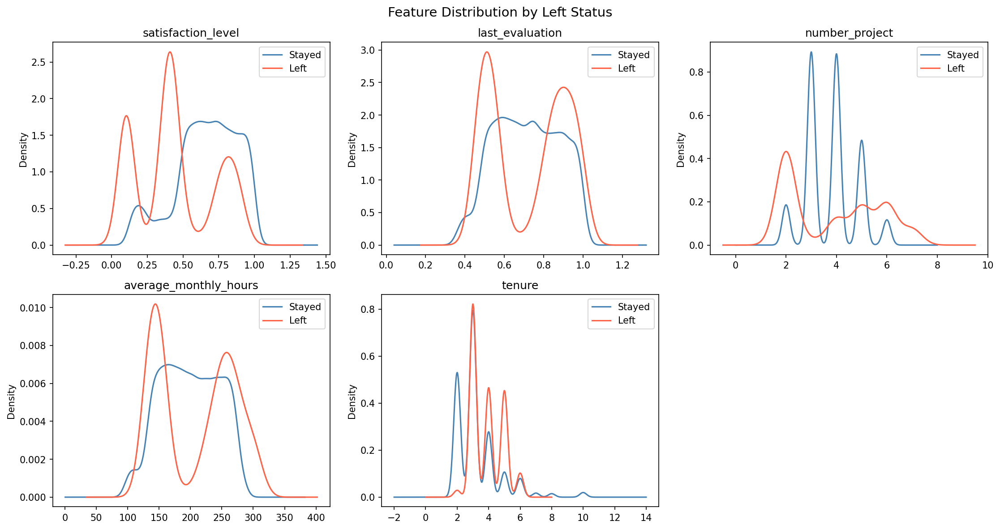
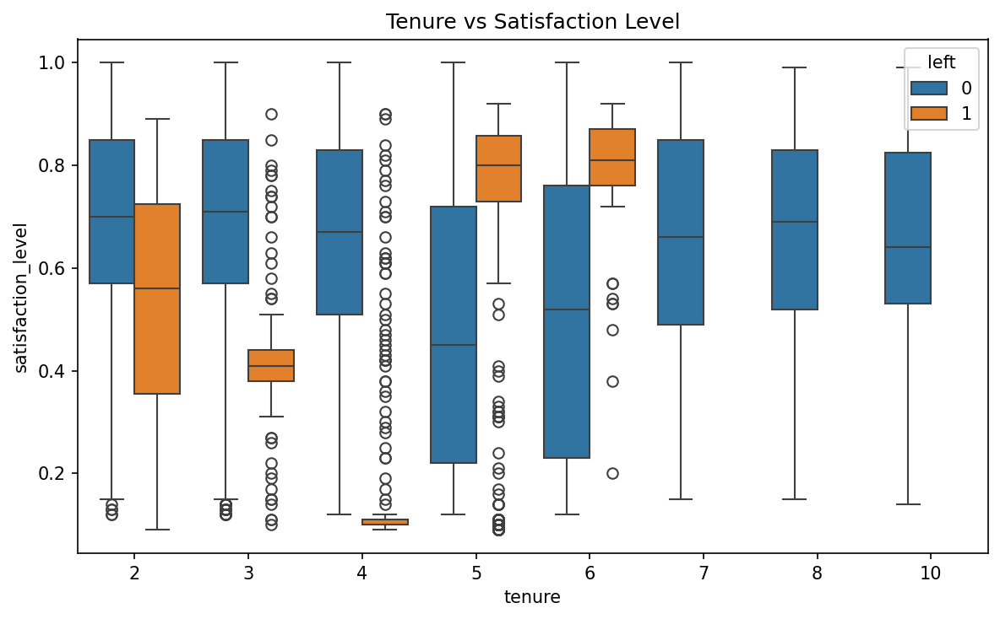
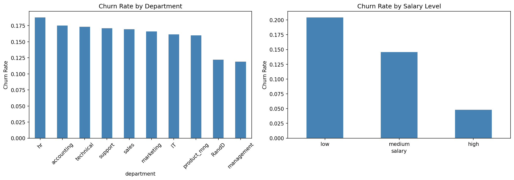
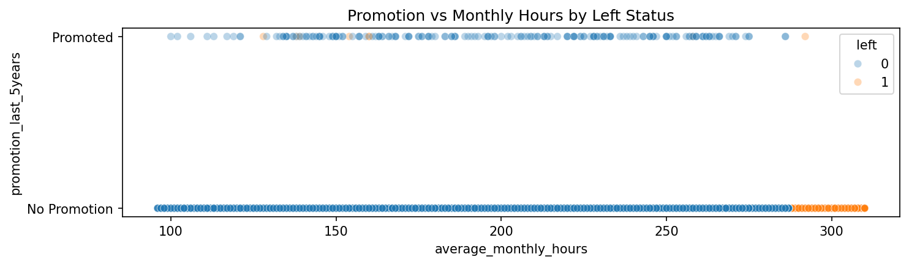
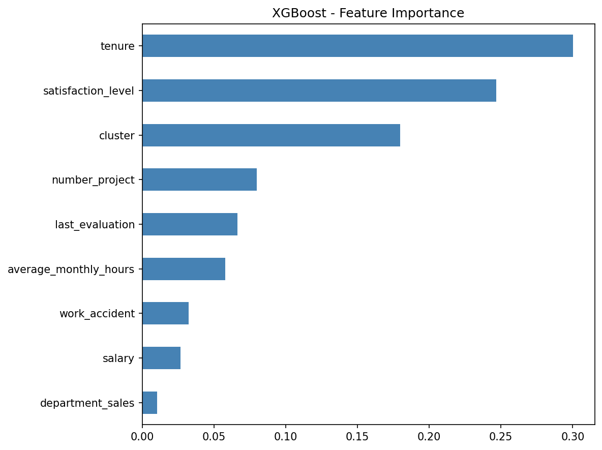
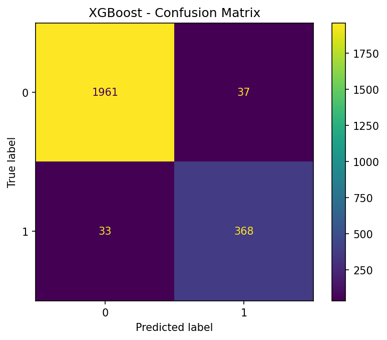

# HR Employee Attrition Analysis — Salifort Motors

## Executive Summary

Salifort Motors is experiencing elevated employee turnover, creating operational disruption and increased hiring costs. This project analyzes employee survey data to identify the key drivers of attrition and develop predictive models that identify employees at risk of leaving.

Exploratory analysis shows that employee satisfaction, tenure, and workload are the strongest factors associated with attrition. Clustering analysis further identified three employee segments with very different attrition risk levels.

Several models were trained and evaluated, including Logistic Regression, Decision Tree, Random Forest, and XGBoost. XGBoost achieved the best performance, with 97% accuracy, 0.987 AUC, and an F1-score of 0.91 on the test set.

These results provide insights into employee turnover patterns and support more targeted retention strategies.

---

## Business Problem

Employee turnover generates substantial costs through recruitment, onboarding, and lost productivity. Salifort Motors aims to understand why employees leave and which employees are most at risk of departure, enabling more targeted retention strategies.

This analysis focuses on four key questions:

1. What employee characteristics are most strongly associated with attrition?
2. Are there distinct employee groups with different attrition risk profiles?
3. How accurately can employee attrition be predicted using historical data?
4. What actions could improve employee retention?

The dataset contains 14,999 employee records (11,991 after removing duplicates), including satisfaction level, workload metrics, tenure, promotion history, department, and salary level.

---

## Analysis Approach

**Exploratory Data Analysis**
Compared satisfaction levels, workload, and tenure between employees who stayed and those who left using KDE plots, scatterplots, and correlation analysis.

**Hypothesis Testing**
A Chi-square test was conducted to examine the relationship between salary level and employee attrition.

**Employee Segmentation**
K-Means clustering was used to identify groups of employees with similar work patterns and attrition risk.

**Predictive Modeling**
Four models were trained and compared: Logistic Regression, Decision Tree, Random Forest, and XGBoost. Hyperparameters were optimized using GridSearchCV.

**Evaluation**
Hyperparameters were tuned using GridSearchCV with cross-validation on the training set. The best-performing model was then evaluated on the held-out test set using accuracy, precision, recall, F1-score, and AUC-ROC.

---

## Key Insights

### Employee segments show large differences in attrition risk

K-Means clustering identified three distinct employee segments with very different attrition rates.

| Cluster | Label | Satisfaction | Monthly Hours | Tenure | Attrition Rate |
|---------|-------|-------------|---------------|--------|----------------|
| 0 | Overworked | 0.42 | 234 hrs | 5.1 yrs | 42% |
| 1 | Healthy | 0.76 | 211 hrs | 2.9 yrs | 2% |
| 2 | Disengaged | 0.53 | 158 hrs | 3.1 yrs | 26% |

Employees in the overworked segment have the highest attrition risk, while the healthy segment shows very low turnover.

---

### Employee satisfaction strongly predicts attrition

Employees who left the company report significantly lower satisfaction levels. Attrition risk also increases during the 3–5 year tenure window, suggesting that mid-tenure employees are more likely to leave.

---

### Salary level is significantly associated with attrition

Employees with low salaries show a 20.5% attrition rate, compared with 4.8% for high-salary employees. A Chi-square test confirms that salary level and attrition are significantly associated (χ² = 175.21, p < 0.001).

Department differences are relatively small, with attrition ranging from 12%–19% across departments.

---

### Overwork without promotion increases attrition risk

Employees working 250+ monthly hours without a promotion in the past five years show the highest departure rates, suggesting that unrecognized overwork contributes to turnover.

---

### XGBoost provides the strongest predictive performance

| Model | Precision | Recall | F1 | Accuracy | AUC |
|-------|-----------|--------|----|----------|-----|
| Logistic Regression | 0.42 | 0.84 | 0.56 | 0.78 | — |
| Decision Tree | 0.783 | 0.926 | 0.849 | 0.945 | 0.960 |
| Random Forest | 0.983 | 0.914 | 0.947 | 0.983 | 0.983 |
| **XGBoost** | **0.899** | **0.938** | **0.918** | **0.972** | **0.987** |

XGBoost achieved the best overall performance and correctly identified 368 of 401 employees who left in the test dataset. The most important predictors include tenure, satisfaction level, and employee cluster membership.

---

## Business Recommendations

- **Prioritize high-risk employees** — Employees in the overworked cluster show the highest attrition risk. HR should monitor employees with high workloads, long tenure, and declining satisfaction scores.
- **Address workload imbalance** — Both excessive workload and under-utilization are associated with higher attrition. Adjusting project allocation and workload expectations may reduce turnover.
- **Review compensation for lower-salary employees** — Since salary level is significantly associated with attrition, targeted salary reviews or benefits adjustments may improve retention.
- **Strengthen promotion and recognition pathways** — Employees working long hours without promotions show elevated departure rates. Clear career development paths and recognition programs could improve retention.
- **Focus on the 3–5 year tenure window** — Mid-tenure employees show the highest attrition risk. Structured career development discussions during this period may help prevent voluntary departures.

---

## Data Dictionary

| Column | Type | Description |
|--------|------|-------------|
| satisfaction_level | float | Employee self-reported satisfaction level (0–1) |
| last_evaluation | float | Score from the most recent performance review |
| number_project | int | Number of projects assigned |
| average_monthly_hours | int | Average monthly working hours |
| tenure | int | Years employed at the company |
| work_accident | int | Whether the employee had a workplace accident (0/1) |
| promotion_last_5years | int | Whether the employee was promoted in the past 5 years (0/1) |
| department | object | Employee department |
| salary | object | Salary level (low, medium, high) |
| left | int | Whether the employee left the company (0/1) |

---

## Skills Demonstrated

`Python` `Exploratory Data Analysis` `Hypothesis Testing` `K-Means Clustering` `Feature Engineering` `Machine Learning Modeling` `Hyperparameter Tuning (GridSearchCV)` `Model Evaluation` `Random Forest` `XGBoost`
