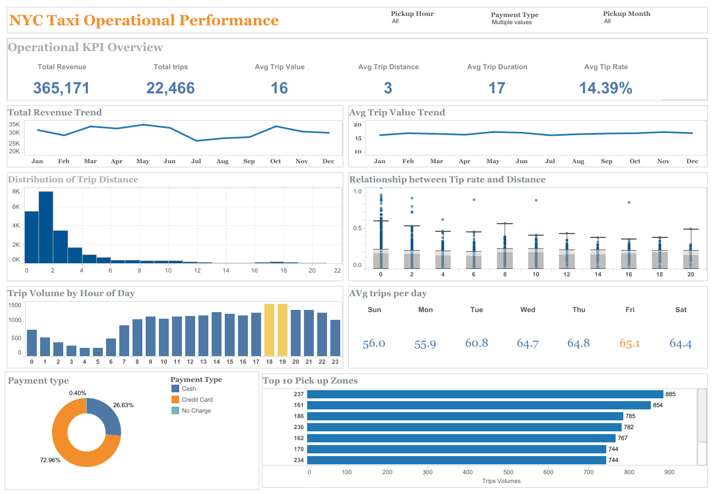

# NYC Taxi Operational Performance Analysis

## Executive Summary

This project analyzes 2017 NYC yellow taxi trip data to evaluate operational 
performance and passenger behavior. The analysis examines trip demand patterns, 
revenue distribution, tipping behavior, and geographic pickup activity.

Results show that taxi demand is highly concentrated during evening commute hours, 
most trips are short urban journeys, and credit card payments dominate transaction 
methods. Because cash tips are not recorded in the dataset, the observed tipping 
behavior likely underestimates actual tip levels.

---

## Dataset

| Attribute | Value |
|---|---|
| Source | NYC Open Data — 2017 Yellow Taxi Trip Data |
| Rows | 408,294 |
| Columns | 18 |
| Granularity | Individual trip level |

Key variables include trip timestamps, trip distance, fare amount, tip amount, 
payment type, and pickup/dropoff zones.

---

## Business Questions

1. How does revenue trend across the year, and is there any seasonality?
2. What does a typical trip look like in terms of distance, duration, and value?
3. When are peak demand hours and days of the week?
4. Is there a relationship between trip distance and tipping behavior?
5. Which pickup zones generate the highest trip volumes?
6. How do passengers prefer to pay, and how does this affect recorded tipping behavior?

---

## Workflow

### 1️⃣ Data Cleaning — Python
- Explored dataset structure, data types, and descriptive statistics
- Renamed columns to ensure clarity
- Converted datetime fields from string to datetime format
- Identified and removed invalid records (negative fares, zero distance, zero passengers)
- Exported cleaned data as CSV for Tableau and MySQL

### 2️⃣ Data Analysis — MySQL
- Manually created table schema and imported cleaned data
- Created a base view `vw_taxi_analysis` adding derived metrics: trip duration, revenue per mile, and tip rate
- Built additional views to answer each business question:
  - `vw_kpi_summary` — overall performance KPIs
  - `vw_hourly_demand` — trip volume by hour
  - `vw_payment_revenue` — revenue by payment type
  - `vw_top_pickup_zones` — top 10 busiest pickup zones

### 3️⃣ Visualization — Tableau

An interactive dashboard was built to explore operational performance and 
passenger behavior. Key dashboard components include:

- KPI cards summarizing overall performance
- Revenue and average trip value trends across the year
- Trip distance distribution to to understand what a typical trip looks like
- Hourly and daily trip volume to spot peak demand periods
- Tip rate vs. distance to see whether trip length affects tipping behavior
- Payment type breakdown to understand passenger preferences
- Top 10 pickup zones to identify where most trips originate

Filters allow users to explore results by hour, month, and payment type.

---

## Key Findings

**Demand peaks during evening commute hours**  
Trip volume peaks around **18:00–19:00**, reflecting typical evening commuting 
patterns. The lowest activity occurs between **2:00–5:00 AM**.

**Trip distances are generally short**  
Most trips are **under 4 miles**, indicating the service primarily supports 
short urban travel rather than long-distance transportation.

**Revenue shows stable demand across the year**  
Revenue levels remain relatively consistent throughout 2017, suggesting taxi 
demand is driven by daily commuting patterns rather than strong seasonal effects.

**Friday is the busiest day of the week**  
Average daily trips peak on **Fridays (65.1 trips)**, while Sunday and Monday 
record the lowest demand.

**Tip behavior shows little relationship with distance**  
Tip rate does not show a strong correlation with trip distance, indicating 
tipping behavior may depend more on payment method or passenger habits.

**Credit card is the dominant payment method**  
Credit card payments account for **72.96% of trips**, while cash represents 
**26.63%**. Because cash tips are not recorded in the dataset, the observed 
tipping rates likely underestimate actual tip behavior.

---

## Dashboard Preview

🔗 [View Interactive Dashboard on Tableau Public](https://public.tableau.com/views/NYCTaxiOperationalPeformanceAnalysis/TaxiBusinessPerformanceDashboard?:language=en-US&:sid=&:redirect=auth&:display_count=n&:origin=viz_share_link)
