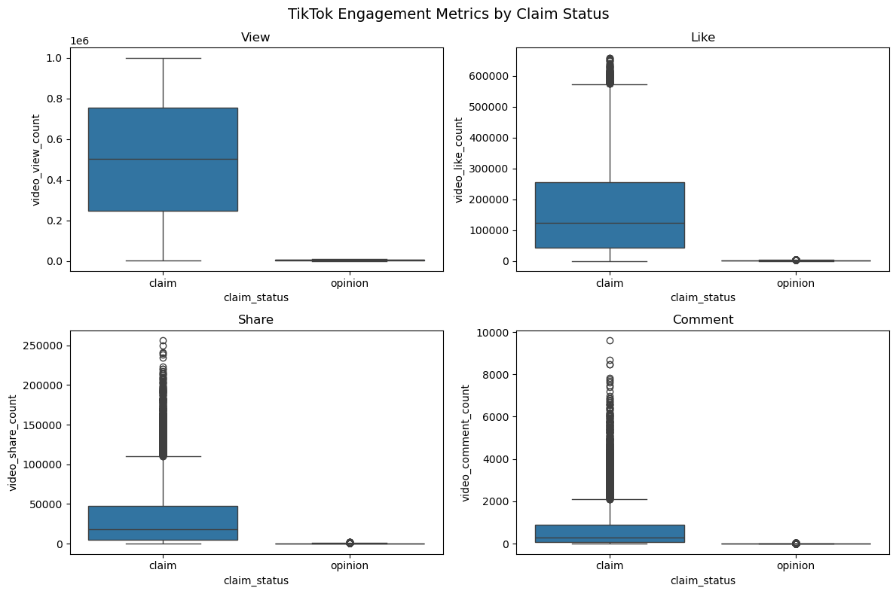
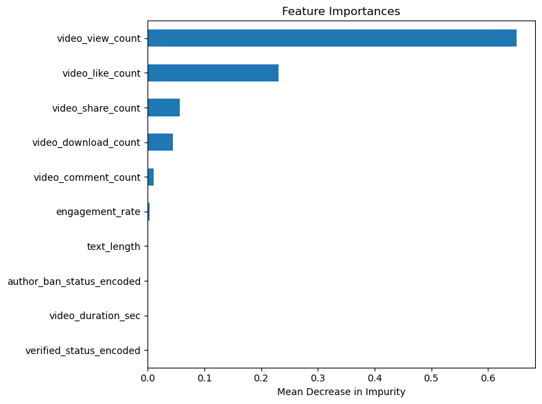
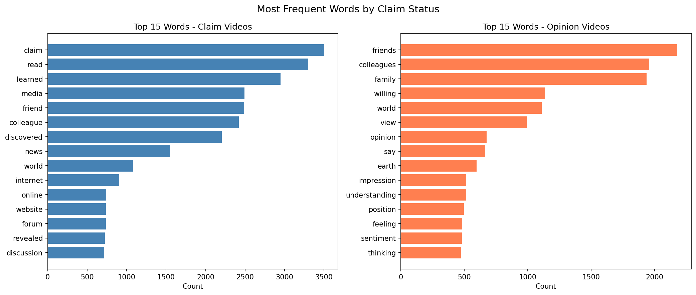
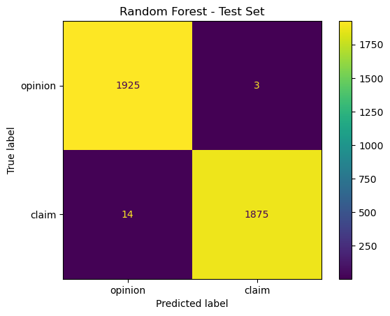

# TikTok Content Classification Analysis

## Executive Summary

This project analyzes TikTok videos to distinguish claim-based content from opinion-based content and evaluate whether machine learning models can classify them accurately. Exploratory analysis and hypothesis testing show that engagement metrics are strong signals for distinguishing the two content types. Random Forest achieved nearly 100% accuracy on the test set, outperforming XGBoost.

---

## Business Problem

TikTok hosts a large volume of user-generated content, including factual claims and personal opinions. Users can report videos that may contain misleading claims, but the high number of reports creates a backlog for moderators.
Accurately identifying claim-based content can help prioritize moderation efforts, detect potential misinformation, and improve content ranking.

This analysis focuses on two key questions:
1. Do claim-based videos receive more views than opinion-based videos?
2. Can machine learning classify claim vs opinion videos accurately?

The dataset contains 19,382 TikTok videos with engagement metrics, content features, and creator attributes.

---

## Analysis Approach

1. **EDA** — Examined distributions of engagement metrics, video features, and creator attributes
2. **Hypothesis Testing** — Welch t-test to compare views between claim and opinion videos
3. **Feature Engineering** — Calculated engagement rate, text length, and encoded categorical variables
4. **Modeling** — Trained Random Forest and XGBoost with hyperparameter tuning via GridSearchCV
5. **Evaluation** — Split data into training, validation, and test sets; assessed performance using precision, recall, F1-score, and accuracy

---

## Key Insights

- **Claim videos get more views** — Claim-based videos receive significantly higher view counts than opinion videos, confirming that content type influences visibility.
- Claim videos receive significantly more views
Claim-based videos have higher average view counts than opinion videos. The hypothesis test confirms that the difference is statistically significant.

- **Engagement metrics dominate classification** — Features like video views, likes, and shares are the strongest predictors in the model, showing that user interaction patterns effectively differentiate claim vs opinion videos.
- **Content characteristics have limited impact** — Video duration and transcription text length contribute very little to the model, indicating that engagement signals outweigh structural content features.

- **Claim and opinion videos use distinctly different language** — Claim videos frequently use words like "read", "learned", "media", and "discovered", suggesting unverified second-hand information. Opinion videos use words like "view", "opinion", "feeling", and "impression", reflecting personal perspectives.

- **Machine learning models perform extremely well** — Random Forest achieved 99% precision, 99% recall, and 100% accuracy on the test set, with only 17 misclassifications out of 3,817 samples, demonstrating that the model can reliably classify videos based on engagement patterns.

  
---

## Data Dictionary

| Column | Type | Description |
|---|---|---|
| claim_status | object | Claim or opinion label |
| video_duration_sec | int | Video length in seconds |
| video_transcription_text | object | Transcribed content |
| verified_status | object | Creator verification status |
| author_ban_status | object | Author moderation status |
| video_view_count | float | Number of views |
| video_like_count | float | Number of likes |
| video_share_count | float | Number of shares |
| video_download_count | float | Number of downloads |
| video_comment_count | float | Number of comments |

---

## Skills Demonstrated

`Python` · `Exploratory Data Analysis` · `Hypothesis Testing` · `Feature Engineering` · `Machine Learning Modeling` · `Model Evaluation`

